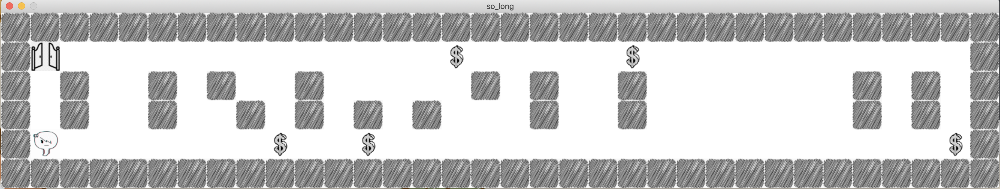
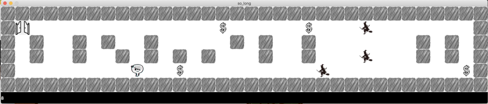

# so_long

Take a look !
---------------

what is so_long ?
-------------------
so_long is a project in the 42 programming school's cummon core. 
it's about making a basic 2D game using mlx library, the game is about escaping the map after taking all the collectibls when trying to avoid enemies if 
they exist (they actually exist in the bonus part). the player can move in the map using WASD keys  

Subject
---------------
[subject.pdf](en.subject.pdf)

Usage
-------
  * for the mandatory part :
      - run `make` to build the mandatory part program
      - run `./so_long <map path>` please choose/create a valid map that only contanes `0` & `1` & `P` & `C` & `E` characters 
      - ENJOY !!
  * for the bonus part :
      - run `make bonus` to build the mandatory part program
      - run `./so_long_bonus <map path>` please choose/create a valid map that only contanes `0` & `1` & `P` & `C` & `E` `W` characters 
      - ENJOY !!
